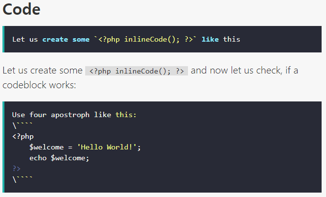
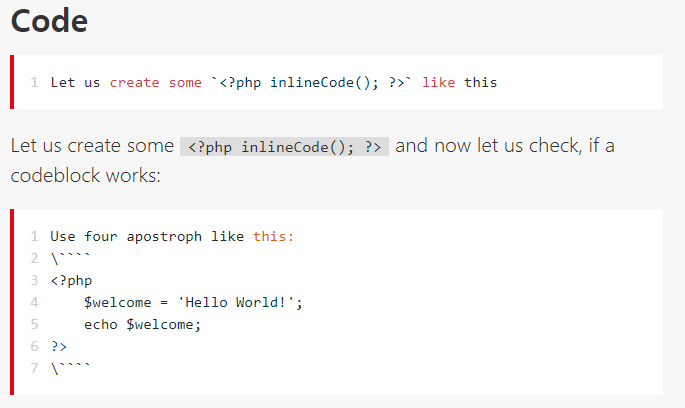

# highlight
Highlight your code examples with highlight.js for Typemill

## Adding feature
- Selecting highlight.js theme (`https://github.com/highlightjs/highlight.js/tree/main/src/styles`)
- line number using highlightjs-line-numbers.js (`https://wcoder.github.io/highlightjs-line-numbers.js/`)

## Pretreatment
- If you face problems with older theme-versions, then remove the following code from `/theme/cyanine/css/style.css`
```css
/* Fix background for hightlight plugin */
code.hljs{ background: transparent; }
```
## snapshot image
### Changing theme


### Changing theme and enabled line number

